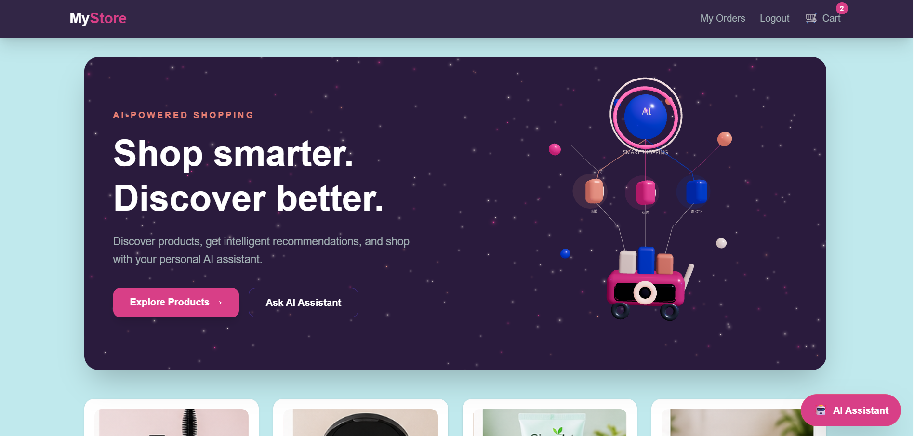
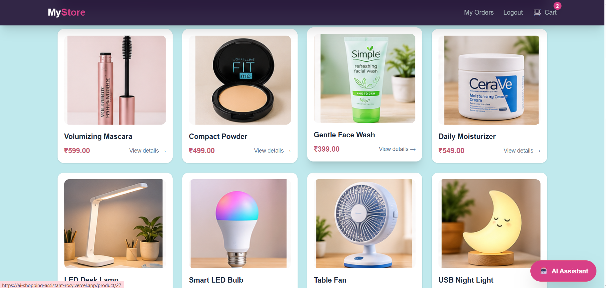
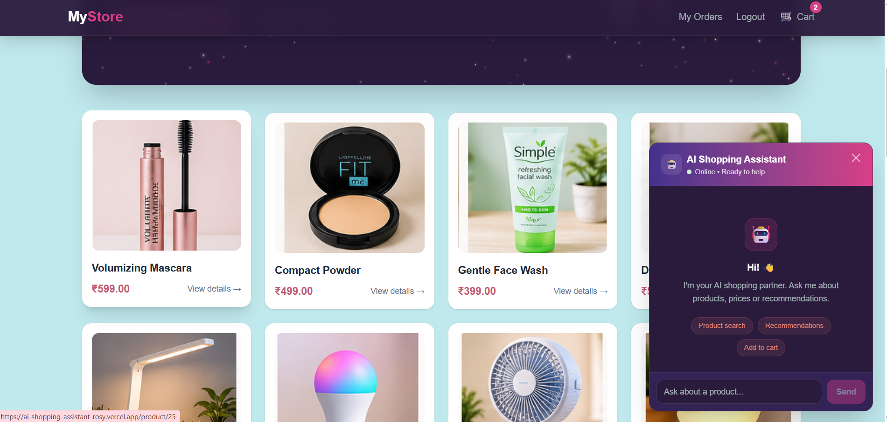
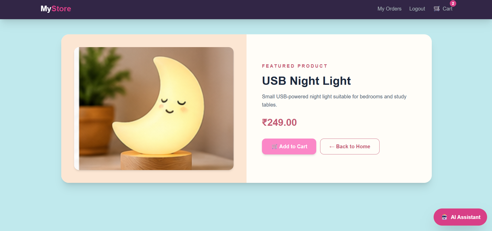
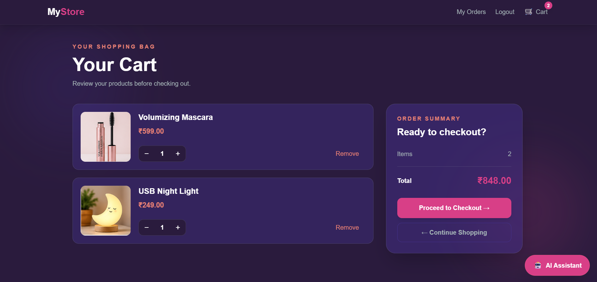
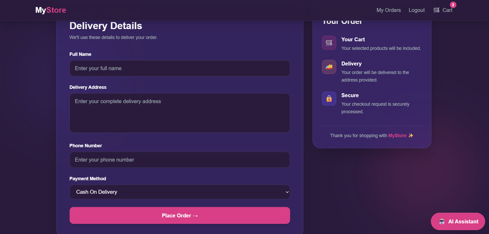
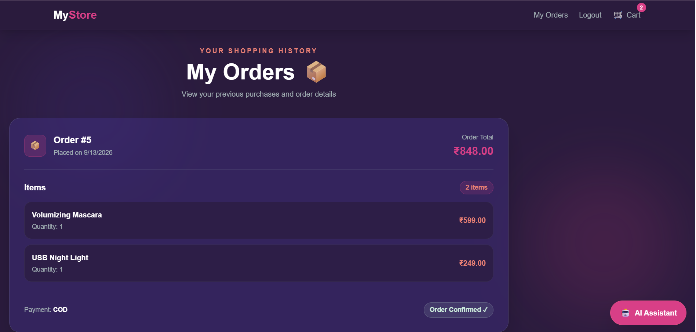

# AI Shopping Assistant

A full-stack e-commerce application with an integrated AI shopping assistant that helps users discover products, manage their cart, and place orders through natural-language interactions.

**Live Demo:** https://ai-shopping-assistant-rosy.vercel.app/

**GitHub:** https://github.com/Amrutha-AITech/AI-Shopping-Assistant


## Overview

AI Shopping Assistant combines a traditional e-commerce workflow with an AI-powered shopping interface.

Users can browse products, view product details, manage their cart, complete checkout, and view their orders. The integrated AI assistant can understand natural-language shopping requests and perform actions such as adding a product directly to the user's cart.


## Key Features

- Natural-language AI assistant for product discovery and recommendations
- Add products to the cart directly through the AI assistant
- Product browsing with dedicated product detail pages
- User registration and login
- Protected routes for authenticated users
- Shopping cart with quantity management and item removal
- Checkout and order creation
- Order history for authenticated users
- Responsive interface for desktop and mobile
- Interactive 3D elements using React Three Fiber


## AI Shopping Assistant

The shopping assistant uses the Gemini API to understand natural-language requests and connect them with the application's product and cart functionality.

For example, a request such as:

```text
"Add the women's kurti to my cart"
```

can be processed by the assistant and connected to the application's cart API.

The flow is:

```text
User request
      ↓
React AI Assistant
      ↓
Django REST API
      ↓
Gemini API
      ↓
Product matched
      ↓
Add-to-cart API
      ↓
Cart updated
```

This allows the AI assistant to go beyond generating text and interact with the application's existing functionality.


## Tech Stack

### Frontend

- React
- Vite
- JavaScript
- Tailwind CSS
- React Router

### Backend

- Python
- Django
- Django REST Framework

### Database

- PostgreSQL

### AI

- Gemini API

### 3D / UI

- React Three Fiber
- Three.js
- Drei

### Deployment

- Vercel — Frontend
- Render — Backend


## Architecture

The application follows a client-server architecture.

- **React frontend** handles the user interface, routing, product browsing, cart interactions, checkout flow, and AI assistant interface.
- **Django REST Framework** provides the backend APIs and handles application logic, authentication, products, cart operations, and orders.
- **PostgreSQL** stores users, products, cart data, and orders.
- **Gemini API** processes natural-language requests from the AI shopping assistant.
- **Vercel** hosts the React frontend.
- **Render** hosts the Django backend.


## Application Flow

```text
User
 │
 ▼
React + Vite Frontend
 │
 ├── Product Browsing
 ├── Product Details
 ├── Cart
 ├── Checkout
 ├── Orders
 └── AI Shopping Assistant
          │
          ▼
    Django REST API
          │
     ┌────┴────┐
     ▼         ▼
PostgreSQL  Gemini API
     │
     ▼
Users / Products / Cart / Orders
```


## Screenshots

### Home Page





### AI Shopping Assistant



### Product Details



### Shopping Cart



### Checkout



### Orders



## Running Locally

### Prerequisites

Make sure you have the following installed:

- Python 3
- Node.js and npm
- PostgreSQL
- Git


### Backend Setup

Open a terminal:

```bash
cd backend
python -m venv venv
venv\Scripts\activate
pip install -r requirements.txt
python manage.py migrate
python manage.py runserver
```

The backend requires PostgreSQL and the Gemini API to be configured through environment variables.


### Frontend Setup

Open a new terminal:

```bash
cd frontend
npm install
npm run dev
```

Create a `.env` file inside the `frontend` directory:

```env
VITE_DJANGO_BASE_URL=http://127.0.0.1:8000
```

The frontend uses this URL to communicate with the Django REST API.


## What I Learned

- Building a full-stack application with React and Django REST Framework
- Designing and consuming REST APIs between frontend and backend
- Working with PostgreSQL for application data
- Implementing authentication and protected user functionality
- Integrating Gemini into an application workflow
- Connecting AI responses to real application actions
- Deploying and debugging a full-stack application in production
- Managing environment variables and frontend-backend communication


## Future Improvements

- Improve AI recommendations using user preferences and product history
- Add product search, filtering, and sorting
- Add online payment integration
- Add order tracking
- Add automated testing for frontend and backend
- Improve application monitoring and performance


## About

**Amrutha BM**

Full-stack developer focused on building web applications and AI-powered software.

**GitHub:** https://github.com/Amrutha-AITech